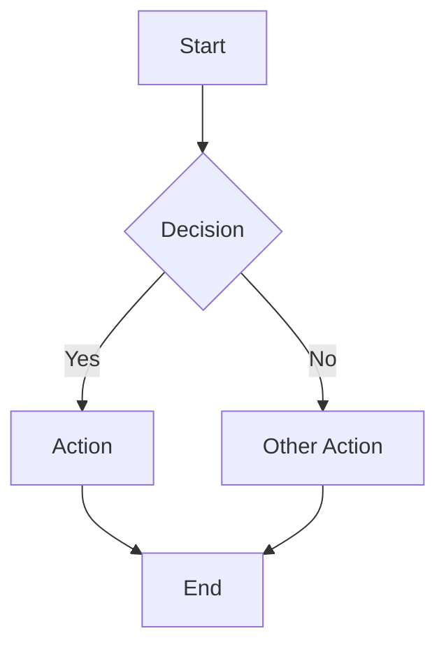
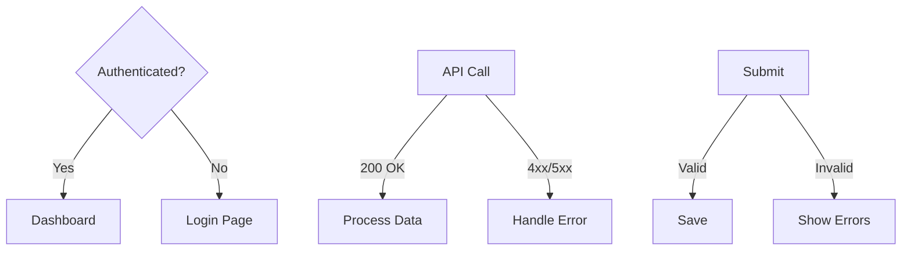
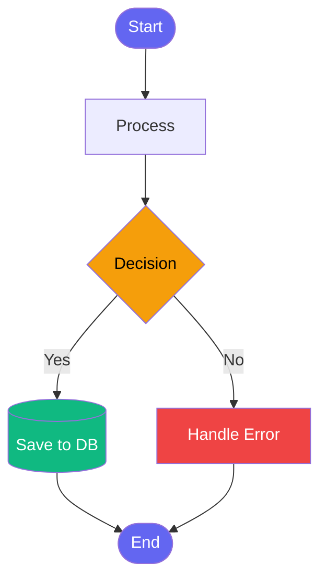
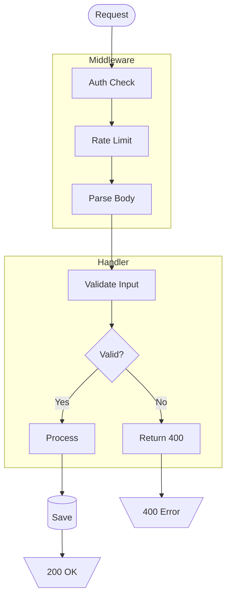
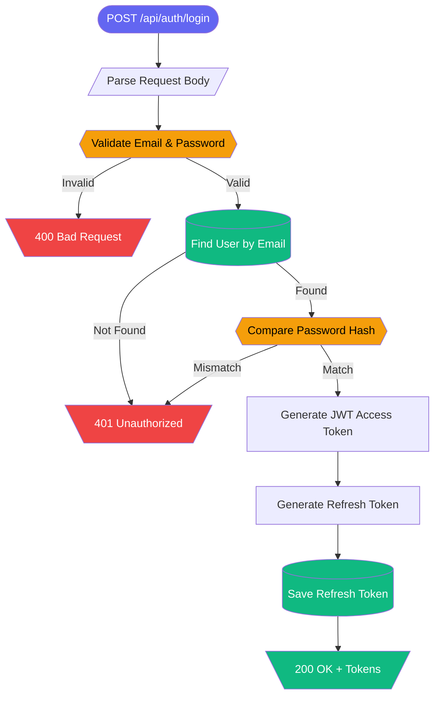

# flowbook — Flowchart Documentation Generator

Analyze codebase logic → setup flowbook → generate `.flow.md` files → verify → build.

**Execute ALL phases in order. Do NOT skip phases. Generate flows for ALL significant logic — not just a few.**

---

## Phase 1: Project Analysis

### 1.1 Check Flowbook Existence

Check if flowbook is already set up:

- `package.json` has `"flowbook"` script → Already initialized, skip Phase 2
- Otherwise → Proceed to Phase 2

### 1.2 Detect Package Manager

| Lockfile | PM |
|----------|----|
| `bun.lock` or `bun.lockb` | bun |
| `pnpm-lock.yaml` | pnpm |
| `yarn.lock` | yarn |
| `package-lock.json` | npm |

### 1.3 Detect Framework & Language

Read `package.json` dependencies:

| Dependency | Framework |
|------------|-----------|
| `next` | Next.js |
| `nuxt` | Nuxt |
| `@sveltejs/kit` | SvelteKit |
| `svelte` (no kit) | Svelte |
| `vue` (no nuxt) | Vue |
| `@angular/core` | Angular |
| `express` / `fastify` / `hono` / `koa` | Node.js Backend |
| `@nestjs/core` | NestJS |
| `react` (no next) | React |
| `django` / `flask` / `fastapi` | Python Backend |
| `spring` | Java/Kotlin Backend |
| `gin` / `echo` / `fiber` | Go Backend |

Language detection:
- `tsconfig.json` → TypeScript
- `*.go` files → Go
- `*.py` files → Python
- `*.java` / `*.kt` files → Java/Kotlin
- Otherwise → JavaScript

### 1.4 Detect Source Structure

Scan for actual source directories:

**Frontend:**
- `src/components/`, `src/pages/`, `src/views/`, `src/routes/`
- `src/app/`, `app/`, `pages/`, `components/`
- `src/store/`, `src/hooks/`, `src/composables/`, `src/lib/`

**Backend:**
- `src/routes/`, `src/api/`, `src/controllers/`, `src/services/`
- `src/middleware/`, `src/handlers/`, `src/resolvers/`
- `routes/`, `api/`, `controllers/`, `services/`

**Shared:**
- `src/utils/`, `src/helpers/`, `src/lib/`
- `src/models/`, `src/schemas/`, `src/types/`

Only include directories that actually exist.

---

## Phase 2: Flowbook Setup

### 2.1 Initialize Flowbook

```bash
npx flowbook@latest init
```

This will:
- Install `flowbook` as a devDependency
- Add `"flowbook"` and `"build-flowbook"` scripts to `package.json`
- Create `flows/example.flow.md` as a starter template
- Add `flowbook-static` to `.gitignore`

### 2.2 Verify Setup

Check that:
- `package.json` contains `"flowbook": "flowbook dev"` script
- `flowbook` is in `devDependencies`
- `flows/` directory exists

### 2.3 Remove Example Flow

After verification, delete the example to replace with real flows:

```bash
rm flows/example.flow.md
```

---

## Phase 3: Codebase Analysis & Flow Discovery

This is the **most critical phase**. Deeply analyze the codebase to identify all significant logic flows.

### 3.1 Flow Categories to Discover

Scan the codebase for these flow types. For EACH one found, plan a `.flow.md` file:

#### A. API / Route Flows
- HTTP request → middleware chain → handler → response
- REST endpoints (GET, POST, PUT, DELETE)
- GraphQL resolvers (Query, Mutation)
- WebSocket message flows
- RPC handlers

#### B. Authentication & Authorization
- Login / signup / logout flows
- Token refresh / session management
- OAuth flows (redirect → callback → token exchange)
- Role-based access control (RBAC) decision trees
- Password reset / email verification

#### C. Data Flows
- CRUD operations (Create → Validate → Save → Respond)
- Data pipeline / ETL (Extract → Transform → Load)
- Form submission → validation → API call → state update
- File upload → process → store → respond
- Cache strategies (read-through, write-through, invalidation)

#### D. State Management
- Global state flow (Redux, Zustand, Pinia, Vuex)
- Action → Reducer → State → UI update cycle
- Side effects (Sagas, Thunks, Effects)
- Optimistic updates → rollback on failure

#### E. Business Logic
- Order processing / checkout flow
- Payment flow (initiate → process → confirm / refund)
- Notification system (trigger → queue → send → track)
- Scheduling / cron job flows
- Approval workflows (submit → review → approve/reject)

#### F. Error Handling
- Global error boundary flow
- Retry strategies (exponential backoff)
- Fallback / circuit breaker patterns
- Error logging / monitoring pipeline

#### G. DevOps & Infrastructure
- CI/CD pipeline stages
- Deployment flow
- Health check / monitoring flow
- Database migration flow

#### H. Lifecycle & Initialization
- App bootstrap / initialization sequence
- Component lifecycle flows
- Server startup → middleware registration → route binding → listen
- Database connection → migration → seeding → ready

### 3.2 How to Analyze

For each source file:

1. **Read the file** — understand its purpose
2. **Trace the flow** — follow function calls, conditionals, async operations
3. **Identify decision points** — if/else, switch, try/catch, early returns
4. **Map dependencies** — what other modules/services does it call?
5. **Note error paths** — what happens when things fail?

### 3.3 Flow Classification

For each discovered flow, determine:

| Field | How to Determine |
|-------|-----------------|
| `title` | Clear, descriptive name (e.g., "User Login Flow") |
| `category` | Group by domain: Authentication, API, Data, State, Business, DevOps, etc. |
| `tags` | Relevant keywords for filtering |
| `order` | Lower = more important. Core flows first. |
| `description` | One-line summary of what the flow does |

### 3.4 Skip Rules

Do NOT create flows for:
- Trivial utility functions (formatDate, slugify, etc.)
- Simple getters/setters with no logic
- Type definitions / interfaces only
- Test files
- Config files (unless they represent a complex pipeline)
- Files that already have corresponding `.flow.md`

---

## Phase 4: Flow File Generation

### 4.1 File Placement

Place ALL flow files in the `flows/` directory at project root:

```
flows/
├── auth-login.flow.md
├── auth-oauth.flow.md
├── api-user-crud.flow.md
├── data-order-processing.flow.md
├── state-cart-management.flow.md
└── devops-ci-pipeline.flow.md
```

**Naming convention**: `{category}-{name}.flow.md` (kebab-case)

### 4.2 Flow File Template

Every `.flow.md` file MUST follow this structure:

````markdown
---
title: {Descriptive Title}
category: {Category Name}
tags: [{tag1}, {tag2}, {tag3}]
order: {number}
description: {One-line description}
---


````

### 4.3 Mermaid Diagram Guidelines

#### Node Types

```mermaid
flowchart TD
    A[Regular Step]         %% Rectangle: action/process
    B{Decision Point}       %% Diamond: if/else, switch
    C([Start / End])        %% Stadium: entry/exit points
    D[(Database)]           %% Cylinder: DB operations
    E[[Sub-routine]]        %% Subroutine: function call
    F>Event / Signal]       %% Flag: async event, webhook
    G{{Validation}}         %% Hexagon: validation step
    H[/Input/]              %% Parallelogram: user input
    I[\Output\]             %% Reverse parallelogram: response
```

#### Edge Labels



#### Styling

Apply consistent colors to node types:



**Color convention:**
- `#6366f1` (indigo) — Start/End points
- `#10b981` (green) — Success paths, DB operations
- `#f59e0b` (amber) — Decision points
- `#ef4444` (red) — Error paths, failures
- `#8b5cf6` (purple) — External service calls
- `#3b82f6` (blue) — Processing steps
- Default (no style) — Regular steps

#### Subgraphs for Complex Flows

Use subgraphs to group related steps:



### 4.4 Complexity Guidelines

- **Simple flows** (3-8 nodes): Single linear or branching flow
- **Medium flows** (8-15 nodes): Multiple branches, some subgraphs
- **Complex flows** (15-25 nodes): Multiple subgraphs, parallel paths
- **Do NOT exceed 25 nodes** per diagram — split into multiple flows instead

If a flow is too complex:
1. Create a high-level overview flow
2. Create detailed sub-flows for each section
3. Reference sub-flows in the overview's description

### 4.5 Real-World Example

For a Next.js API route `app/api/auth/login/route.ts`:

````markdown
---
title: User Login
category: Authentication
tags: [auth, login, jwt, api]
order: 1
description: POST /api/auth/login — validates credentials and returns JWT tokens
---


````

---

## Phase 5: Verification

### 5.1 Syntax Check

For each generated `.flow.md` file:

1. Verify YAML frontmatter is valid (title, category present)
2. Verify mermaid code block is properly fenced (``` mermaid ```)
3. Verify mermaid syntax has no obvious errors (matched brackets, valid node IDs)

### 5.2 Build Verification

```bash
npx flowbook build 2>&1
```

If build fails:
- Read error output
- Fix the issue (likely malformed mermaid syntax)
- Retry until build succeeds

### 5.3 Visual Verification

Start dev server and verify rendering:

```bash
npx flowbook dev &
FB_PID=$!
sleep 3
```

If the `playwright` skill is available, load it and:

1. Navigate to `http://localhost:6200`
2. Wait for Flowbook UI to load
3. Check sidebar — all flow categories should appear
4. Click through each flow — verify diagrams render (no error messages)
5. Screenshot any failures

```bash
kill $FB_PID 2>/dev/null
```

### 5.4 Fix-and-Retry Loop

If mermaid diagrams fail to render:
1. Common issue: special characters in labels — wrap in quotes: `A["Label with (parens)"]`
2. Common issue: reserved keywords — prefix with text: `A[End Point]` not `A[End]` alone as node content after using `End` as ID
3. Re-run build verification
4. Repeat until all diagrams render

---

## Phase 6: Summary Report

Print a summary:

```
=== Flowbook Report ===
Framework: {detected framework}
Language: {detected language}

Flows generated: {N}
Categories:
  - Authentication: {N} flows
  - API: {N} flows
  - Data: {N} flows
  - State: {N} flows
  - Business Logic: {N} flows
  - DevOps: {N} flows

Files created:
  - flows/{filename}.flow.md — {title}
  - flows/{filename}.flow.md — {title}
  ...

Build: ✅ / ❌
```

---

## Troubleshooting

### Flowbook init fails
- **No package.json**: Run `npm init -y` first
- **Permission error**: Check write permissions on project directory

### Mermaid syntax errors
- **Brackets**: Every `[`, `{`, `(` must be closed
- **Special characters in labels**: Wrap in double quotes: `A["User's Input"]`
- **Arrow syntax**: Use `-->` for solid, `-.->` for dotted, `==>` for thick
- **Node ID reuse**: Each node ID must be unique per diagram. Reuse ID to reference same node.
- **Subgraph naming**: Subgraph labels cannot contain special characters

### Diagrams too complex
- Split into overview + detail flows
- Use subgraphs to group related logic
- Keep each diagram under 25 nodes
- Link related flows via description references

### Build fails
- Check mermaid version compatibility (flowbook uses Mermaid 11+)
- Validate YAML frontmatter (no tabs, proper indentation)
- Ensure code blocks use triple backticks with `mermaid` language tag
