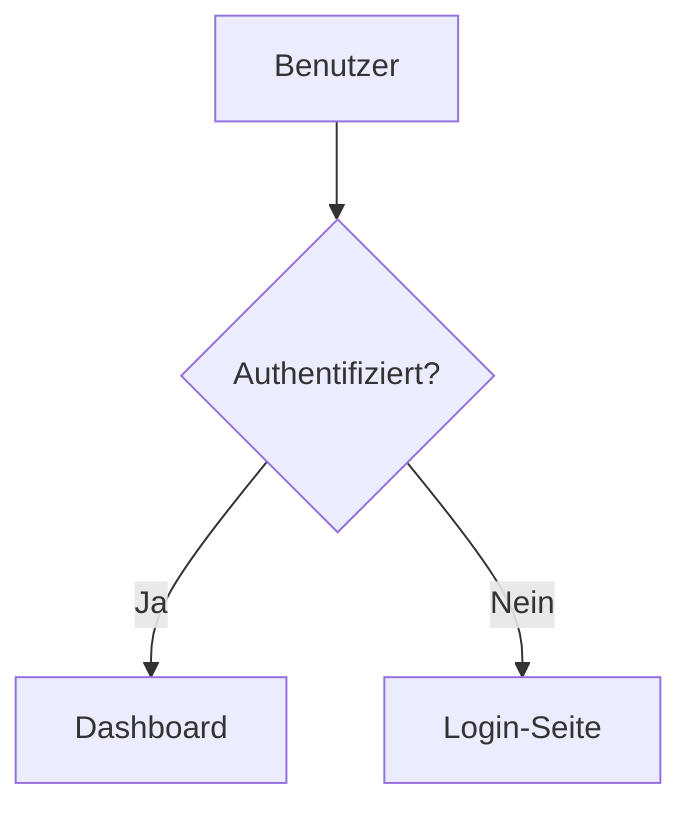

# Flowbook

> [English](./README.md) | [한국어](./README.ko.md) | [简体中文](./README.zh-CN.md) | [日本語](./README.ja.md) | [Español](./README.es.md) | [Português (BR)](./README.pt-BR.md) | [Français](./README.fr.md) | [Русский](./README.ru.md) | **Deutsch**

Storybook für Flussdiagramme. Erkennt automatisch Mermaid-Diagrammdateien in Ihrer Codebasis, organisiert sie nach Kategorien und rendert sie in einem browserbaren Viewer.


## Schnellstart

```bash
# Initialisieren — fügt Skripte + Beispieldatei hinzu
npx flowbook@latest init

# Entwicklungsserver starten
npm run flowbook
# → http://localhost:6200

# Statische Seite erstellen
npm run build-flowbook
# → flowbook-static/
```

## CLI

```
flowbook init                Flowbook im Projekt einrichten
flowbook dev  [--port 6200]  Entwicklungsserver starten
flowbook build [--out-dir d] Statische Seite erstellen
```

### `flowbook init`

- Fügt die Skripte `"flowbook"` und `"build-flowbook"` zu Ihrer `package.json` hinzu
- Erstellt `flows/example.flow.md` als Startvorlage

### `flowbook dev`

Startet einen Vite-Entwicklungsserver unter `http://localhost:6200` mit HMR. Änderungen an `.flow.md`- oder `.flowchart.md`-Dateien werden sofort übernommen.

### `flowbook build`

Erstellt eine statische Seite in `flowbook-static/` (konfigurierbar über `--out-dir`). Überall deploybar.

## Flow-Dateien Erstellen

Erstellen Sie eine `.flow.md`- (oder `.flowchart.md`-) Datei an beliebiger Stelle in Ihrem Projekt:

````markdown
---
title: Login-Ablauf
category: Authentifizierung
tags: [auth, login, oauth]
order: 1
description: Benutzer-Authentifizierungsablauf mit OAuth2
---


````

Flowbook erkennt die Datei automatisch und fügt sie dem Viewer hinzu.

## Frontmatter-Schema

| Feld          | Typ        | Erforderlich | Beschreibung                          |
|---------------|------------|--------------|---------------------------------------|
| `title`       | `string`   | Nein         | Angezeigter Titel (Standard: Dateiname) |
| `category`    | `string`   | Nein         | Kategorie in der Seitenleiste (Standard: "Uncategorized") |
| `tags`        | `string[]` | Nein         | Filterbare Tags                       |
| `order`       | `number`   | Nein         | Sortierreihenfolge innerhalb der Kategorie (Standard: 999) |
| `description` | `string`   | Nein         | Beschreibung in der Detailansicht     |

## Datei-Erkennung

Flowbook durchsucht standardmäßig folgende Muster:

```
**/*.flow.md
**/*.flowchart.md
```

Ignoriert `node_modules/`, `.git/` und `dist/`.

## KI-Agent-Fähigkeit

`flowbook init` installiert automatisch KI-Agent-Fähigkeiten in alle unterstützten Codierungs-Agent-Verzeichnisse.
Wenn ein Codierungs-Agent (Claude Code, OpenAI Codex, VS Code Copilot, Cursor, Gemini CLI usw.) das Schlüsselwort **"flowbook"** in Ihrer Eingabeaufforderung erkennt, wird er:

1. Ihre Codebasis auf logische Abläufe analysieren (API-Routen, Authentifizierung, Zustandsverwaltung, Geschäftslogik usw.)
2. Flowbook einrichten, falls noch nicht initialisiert
3. `.flow.md`-Dateien mit Mermaid-Diagrammen für jeden bedeutenden Ablauf generieren
4. Den Build überprüfen

### Fähigkeit über CLI installieren

Sie können die Fähigkeit auch eigenständig über [skills.sh](https://skills.sh) installieren:

```bash
npx skills add Epsilondelta-ai/flowbook
```

Erkennt automatisch Ihre installierten Codierungs-Agenten und installiert die Fähigkeit in die richtigen Verzeichnisse.

### Kompatible Agenten

| Agent | Fähigkeitsort |
|-------|---------------|
| Claude Code | `.claude/skills/flowbook/SKILL.md` |
| OpenAI Codex | `.agents/skills/flowbook/SKILL.md` |
| VS Code / GitHub Copilot | `.github/skills/flowbook/SKILL.md` |
| Google Antigravity | `.agent/skills/flowbook/SKILL.md` |
| Gemini CLI | `.gemini/skills/flowbook/SKILL.md` |
| Cursor | `.cursor/skills/flowbook/SKILL.md` |
| Windsurf (Codeium) | `.windsurf/skills/flowbook/SKILL.md` |
| AmpCode | `.amp/skills/flowbook/SKILL.md` |
| OpenCode / oh-my-opencode | `.opencode/skills/flowbook/SKILL.md` |

<details>
<summary>Manuelle Fähigkeitsinstallation</summary>

Wenn Sie `flowbook init` oder `npx skills add` nicht verwendet haben, kopieren Sie die Fähigkeit manuell:

```bash
# Beispiel: Claude Code
mkdir -p .claude/skills/flowbook
cp node_modules/flowbook/src/skills/flowbook/SKILL.md .claude/skills/flowbook/

# Beispiel: Cursor
mkdir -p .cursor/skills/flowbook
cp node_modules/flowbook/src/skills/flowbook/SKILL.md .cursor/skills/flowbook/
```

Ersetzen Sie das Verzeichnis durch den entsprechenden Pfad aus der Tabelle der kompatiblen Agenten.

</details>
## Funktionsweise

```
.flow.md-Dateien ──→ Vite-Plugin ──→ Virtuelles Modul ──→ React-Viewer
                       │                    │
                       ├─ fast-glob-Scan    ├─ export default { flows: [...] }
                       ├─ gray-matter       │
                       │  Parsing           └─ HMR bei Dateiänderung
                       └─ Mermaid-Block
                          Extraktion
```

1. **Erkennung** — `fast-glob` durchsucht das Projekt nach `*.flow.md` / `*.flowchart.md`
2. **Parsing** — `gray-matter` extrahiert YAML-Frontmatter; Regex extrahiert `` ```mermaid ``-Blöcke
3. **Virtuelles Modul** — Vite-Plugin stellt geparste Daten als `virtual:flowbook-data` bereit
4. **Rendering** — React-App rendert Mermaid-Diagramme über `mermaid.render()`
5. **HMR** — Dateiänderungen invalidieren das virtuelle Modul und lösen ein Neuladen aus

## Projektstruktur

```
src/
├── types.ts                    # Gemeinsame Typen (FlowEntry, FlowbookData)
├── node/
│   ├── cli.ts                  # CLI-Einstiegspunkt (init, dev, build)
│   ├── server.ts               # Programmatischer Vite-Server & Build
│   ├── init.ts                 # Projekt-Initialisierungslogik
│   ├── discovery.ts            # Datei-Scanner (fast-glob)
│   ├── parser.ts               # Frontmatter + Mermaid-Extraktion
│   └── plugin.ts               # Vite-Plugin für virtuelles Modul
└── client/
    ├── index.html              # Einstiegs-HTML
    ├── main.tsx                # React-Einstiegspunkt
    ├── App.tsx                 # Layout mit Suche + Seitenleiste + Viewer
    ├── vite-env.d.ts           # Typdeklarationen für virtuelles Modul
    ├── styles/globals.css      # Tailwind v4 + benutzerdefinierte Stile
    └── components/
        ├── Header.tsx          # Logo, Suchleiste, Flow-Anzahl
        ├── Sidebar.tsx         # Einklappbarer Kategoriebaum
        ├── MermaidRenderer.tsx # Mermaid-Diagramm-Rendering
        ├── FlowView.tsx        # Einzelne Flow-Detailansicht
        └── EmptyState.tsx      # Leerzustand mit Anleitung
```

## Entwicklung (Beitragen)

```bash
git clone https://github.com/Epsilondelta-ai/flowbook.git
cd flowbook
npm install

# Lokale Entwicklung (verwendet die Root-vite.config.ts)
npm run dev

# CLI erstellen
npm run build

# CLI lokal testen
node dist/cli.js dev
node dist/cli.js build
```

## Technologie-Stack

- **Vite** — Entwicklungsserver mit HMR
- **React 19** — Benutzeroberfläche
- **Mermaid 11** — Diagramm-Rendering
- **Tailwind CSS v4** — Styling
- **gray-matter** — YAML-Frontmatter-Parsing
- **fast-glob** — Datei-Erkennung
- **tsup** — CLI-Bundler
- **TypeScript** — Typsicherheit

## Lizenz

MIT
