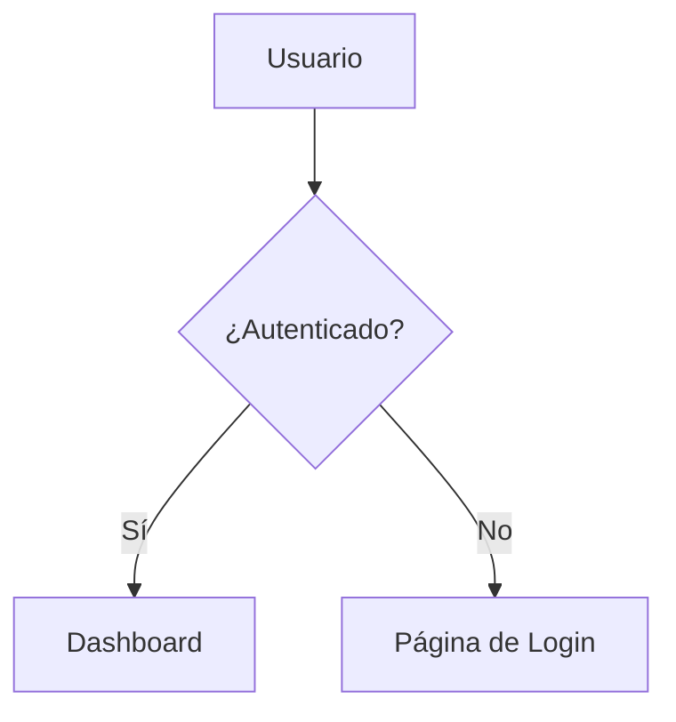

# Flowbook

> [English](./README.md) | [한국어](./README.ko.md) | [简体中文](./README.zh-CN.md) | [日本語](./README.ja.md) | **Español** | [Português (BR)](./README.pt-BR.md) | [Français](./README.fr.md) | [Русский](./README.ru.md) | [Deutsch](./README.de.md)

Storybook para diagramas de flujo. Descubre automáticamente archivos de diagramas Mermaid en tu código, los organiza por categoría y los renderiza en un visor navegable.


## Inicio Rápido

```bash
# Inicializar — agrega scripts + archivo de ejemplo
npx flowbook@latest init

# Iniciar servidor de desarrollo
npm run flowbook
# → http://localhost:6200

# Construir sitio estático
npm run build-flowbook
# → flowbook-static/
```

## CLI

```
flowbook init                Configurar Flowbook en tu proyecto
flowbook dev  [--port 6200]  Iniciar el servidor de desarrollo
flowbook build [--out-dir d] Construir un sitio estático
```

### `flowbook init`

- Agrega los scripts `"flowbook"` y `"build-flowbook"` a tu `package.json`
- Crea `flows/example.flow.md` como plantilla inicial

### `flowbook dev`

Inicia un servidor de desarrollo Vite en `http://localhost:6200` con HMR. Cualquier cambio en archivos `.flow.md` o `.flowchart.md` se refleja instantáneamente.

### `flowbook build`

Construye un sitio estático en `flowbook-static/` (configurable con `--out-dir`). Despliégalo en cualquier lugar.

## Escribir Archivos de Flujo

Crea un archivo `.flow.md` (o `.flowchart.md`) en cualquier lugar de tu proyecto:

````markdown
---
title: Flujo de Login
category: Autenticación
tags: [auth, login, oauth]
order: 1
description: Flujo de autenticación de usuario con OAuth2
---


````

Flowbook descubre automáticamente el archivo y lo agrega al visor.

## Esquema de Frontmatter

| Campo         | Tipo       | Requerido | Descripción                           |
|---------------|------------|-----------|---------------------------------------|
| `title`       | `string`   | No        | Título a mostrar (por defecto: nombre del archivo) |
| `category`    | `string`   | No        | Categoría en la barra lateral (por defecto: "Uncategorized") |
| `tags`        | `string[]` | No        | Etiquetas filtrables                  |
| `order`       | `number`   | No        | Orden dentro de la categoría (por defecto: 999) |
| `description` | `string`   | No        | Descripción en la vista detallada     |

## Descubrimiento de Archivos

Flowbook escanea estos patrones por defecto:

```
**/*.flow.md
**/*.flowchart.md
```

Ignora `node_modules/`, `.git/` y `dist/`.

## Cómo Funciona

```
archivos .flow.md ──→ Plugin Vite ──→ Módulo Virtual ──→ Visor React
                        │                   │
                        ├─ escaneo fast-glob ├─ export default { flows: [...] }
                        ├─ gray-matter       │
                        │  parseo            └─ HMR en cambio de archivo
                        └─ bloque mermaid
                           extracción
```

1. **Descubrimiento** — `fast-glob` escanea el proyecto buscando `*.flow.md` / `*.flowchart.md`
2. **Parseo** — `gray-matter` extrae el frontmatter YAML; regex extrae bloques `` ```mermaid ``
3. **Módulo Virtual** — El plugin de Vite sirve los datos parseados como `virtual:flowbook-data`
4. **Renderizado** — La app React renderiza diagramas Mermaid via `mermaid.render()`
5. **HMR** — Los cambios en archivos invalidan el módulo virtual, disparando una recarga

## Estructura del Proyecto

```
src/
├── types.ts                    # Tipos compartidos (FlowEntry, FlowbookData)
├── node/
│   ├── cli.ts                  # Punto de entrada CLI (init, dev, build)
│   ├── server.ts               # Servidor Vite programático y build
│   ├── init.ts                 # Lógica de inicialización del proyecto
│   ├── discovery.ts            # Escáner de archivos (fast-glob)
│   ├── parser.ts               # Extracción de frontmatter + mermaid
│   └── plugin.ts               # Plugin de módulo virtual de Vite
└── client/
    ├── index.html              # HTML de entrada
    ├── main.tsx                # Entrada React
    ├── App.tsx                 # Layout con búsqueda + barra lateral + visor
    ├── vite-env.d.ts           # Declaraciones de tipo del módulo virtual
    ├── styles/globals.css      # Tailwind v4 + estilos personalizados
    └── components/
        ├── Header.tsx          # Logo, barra de búsqueda, conteo de flujos
        ├── Sidebar.tsx         # Árbol de categorías colapsable
        ├── MermaidRenderer.tsx # Renderizado de diagramas Mermaid
        ├── FlowView.tsx        # Vista detallada de flujo individual
        └── EmptyState.tsx      # Estado vacío con guía
```

## Desarrollo (Contribución)

```bash
git clone https://github.com/Epsilondelta-ai/flowbook.git
cd flowbook
npm install

# Desarrollo local (usa el vite.config.ts raíz)
npm run dev

# Construir CLI
npm run build

# Probar CLI localmente
node dist/cli.js dev
node dist/cli.js build
```

## Stack Tecnológico

- **Vite** — Servidor de desarrollo con HMR
- **React 19** — UI
- **Mermaid 11** — Renderizado de diagramas
- **Tailwind CSS v4** — Estilos
- **gray-matter** — Parseo de frontmatter YAML
- **fast-glob** — Descubrimiento de archivos
- **tsup** — Bundler de CLI
- **TypeScript** — Seguridad de tipos

## Licencia

MIT
