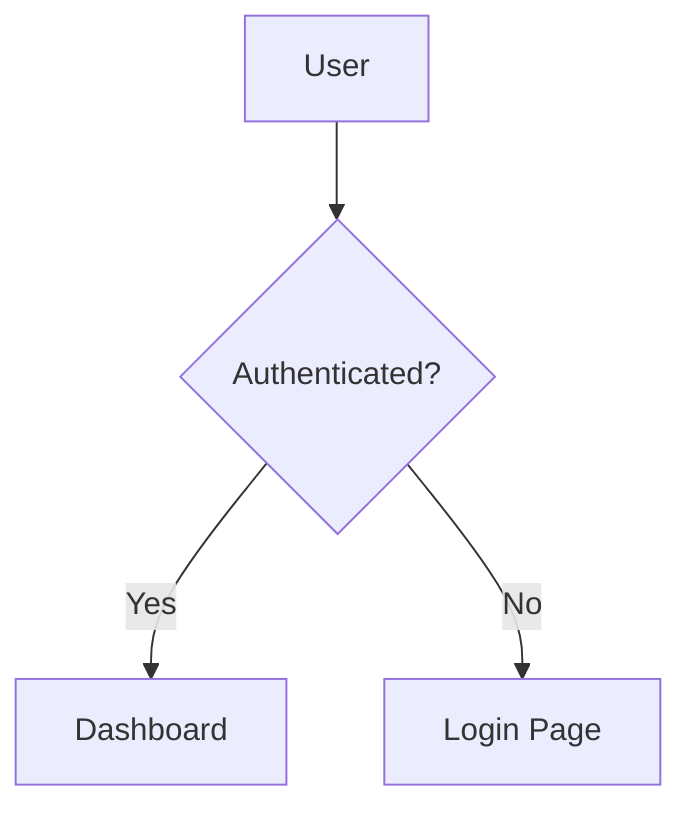

# Flowbook

Storybook for flowcharts. Auto-discovers Mermaid diagram files from your codebase, organizes them by category, and renders them in a browsable viewer.


## Quick Start

```bash
npm install
npm run dev
# → http://localhost:6200
```

## Writing Flow Files

Create a `.flow.md` (or `.flowchart.md`) file anywhere in your project:

````markdown
---
title: Login Flow
category: Authentication
tags: [auth, login, oauth]
order: 1
description: User authentication flow with OAuth2
---


````

Flowbook automatically discovers the file and adds it to the viewer.

## Frontmatter Schema

| Field         | Type       | Required | Description                        |
|---------------|------------|----------|------------------------------------|
| `title`       | `string`   | No       | Display title (defaults to filename) |
| `category`    | `string`   | No       | Sidebar category (defaults to "Uncategorized") |
| `tags`        | `string[]` | No       | Filterable tags                    |
| `order`       | `number`   | No       | Sort order within category (default: 999) |
| `description` | `string`   | No       | Description shown in detail view   |

## File Discovery

Flowbook scans for these patterns by default:

```
**/*.flow.md
**/*.flowchart.md
```

Ignores `node_modules/`, `.git/`, and `dist/`.

## How It Works

```
.flow.md files ──→ Vite Plugin ──→ Virtual Module ──→ React Viewer
                    │                   │
                    ├─ fast-glob scan   ├─ export default { flows: [...] }
                    ├─ gray-matter      │
                    │  parse            └─ HMR on file change
                    └─ mermaid block
                       extraction
```

1. **Discovery** — `fast-glob` scans the project for `*.flow.md` / `*.flowchart.md`
2. **Parsing** — `gray-matter` extracts YAML frontmatter; regex extracts `` ```mermaid `` blocks
3. **Virtual Module** — Vite plugin serves parsed data as `virtual:flowbook-data`
4. **Rendering** — React app renders Mermaid diagrams via `mermaid.render()`
5. **HMR** — File changes invalidate the virtual module, triggering a reload

## Project Structure

```
src/
├── types.ts                    # Shared types (FlowEntry, FlowbookData)
├── node/
│   ├── discovery.ts            # File scanner (fast-glob)
│   ├── parser.ts               # Frontmatter + mermaid extraction
│   └── plugin.ts               # Vite virtual module plugin
└── client/
    ├── main.tsx                # React entry
    ├── App.tsx                 # Layout with search + sidebar + viewer
    ├── vite-env.d.ts           # Virtual module type declarations
    ├── styles/globals.css      # Tailwind v4 + custom styles
    └── components/
        ├── Header.tsx          # Logo, search bar, flow count
        ├── Sidebar.tsx         # Collapsible category tree
        ├── MermaidRenderer.tsx # Mermaid diagram rendering
        ├── FlowView.tsx        # Single flow detail view
        └── EmptyState.tsx      # Empty state with guide
```

## Tech Stack

- **Vite** — Dev server with HMR
- **React 19** — UI
- **Mermaid 11** — Diagram rendering
- **Tailwind CSS v4** — Styling
- **gray-matter** — YAML frontmatter parsing
- **fast-glob** — File discovery
- **TypeScript** — Type safety

## Scripts

```bash
npm run dev       # Start dev server (port 6200)
npm run build     # Production build to dist/
npm run preview   # Preview production build
```

## License

MIT
