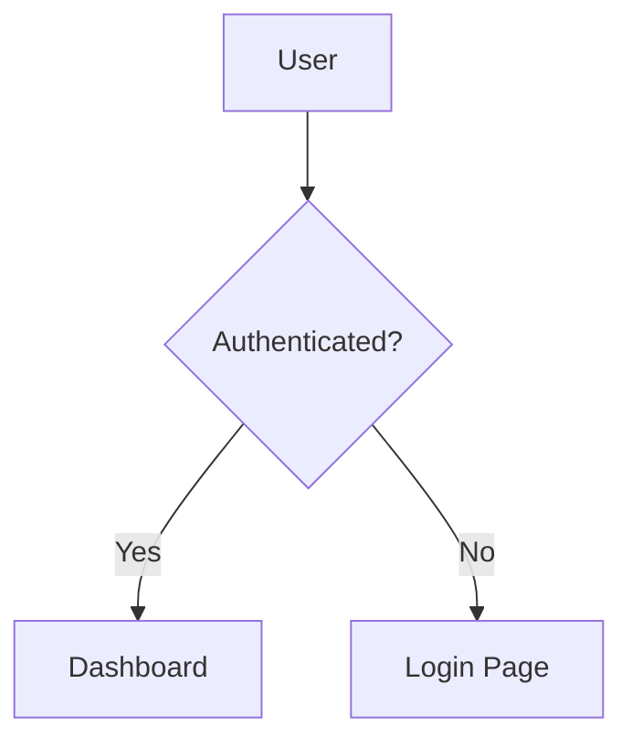

# Flowbook

> **English** | [한국어](./docs/README.ko.md) | [简体中文](./docs/README.zh-CN.md) | [日本語](./docs/README.ja.md) | [Español](./docs/README.es.md) | [Português (BR)](./docs/README.pt-BR.md) | [Français](./docs/README.fr.md) | [Русский](./docs/README.ru.md) | [Deutsch](./docs/README.de.md)

Storybook for flowcharts. Auto-discovers Mermaid diagram files from your codebase, organizes them by category, and renders them in a browsable viewer.


## Quick Start

```bash
# Initialize — adds scripts + example file
npx flowbook@latest init

# Start dev server
npm run flowbook
# → http://localhost:6200

# Build static site
npm run build-flowbook
# → flowbook-static/
```

## CLI

```
flowbook init                Set up Flowbook in your project
flowbook dev  [--port 6200]  Start the dev server
flowbook build [--out-dir d] Build a static site
flowbook skill <agent> [-g]  Install AI agent skill & /flowbook command
```

### `flowbook init`

- Adds `"flowbook"` and `"build-flowbook"` scripts to your `package.json`

### `flowbook dev`

Starts a Vite dev server at `http://localhost:6200` with HMR. Any `.flow.md` or `.flowchart.md` file changes are picked up instantly.

### `flowbook build`

Builds a static site to `flowbook-static/` (configurable via `--out-dir`). Deploy it anywhere.

## Writing Flow Files

Create a `.flow.md` (or `.flowchart.md`) file anywhere in your project:

````markdown
---
title: Login Flow
category: Authentication
tags: [auth, login, oauth]
order: 1
description: User authentication flow with OAuth2
---


````

Flowbook automatically discovers the file and adds it to the viewer.

## Frontmatter Schema

| Field         | Type       | Required | Description                        |
|---------------|------------|----------|------------------------------------|
| `title`       | `string`   | No       | Display title (defaults to filename) |
| `category`    | `string`   | No       | Sidebar category (defaults to "Uncategorized") |
| `tags`        | `string[]` | No       | Filterable tags                    |
| `order`       | `number`   | No       | Sort order within category (default: 999) |
| `description` | `string`   | No       | Description shown in detail view   |

## File Discovery

Flowbook scans for these patterns by default:

```
**/*.flow.md
**/*.flowchart.md
```

Ignores `node_modules/`, `.git/`, and `dist/`.

## AI Agent Skill

Use `flowbook skill` to install AI agent skills and `/flowbook` slash commands for your coding agents.
When a coding agent (Claude Code, OpenAI Codex, VS Code Copilot, Cursor, Gemini CLI, etc.) detects the keyword **"flowbook"** in your prompt, it will:

1. Analyze your codebase for logical flows (API routes, auth, state management, business logic, etc.)
2. Set up Flowbook if not already initialized
3. Generate `.flow.md` files with Mermaid diagrams for every significant flow
4. Verify the build

### `flowbook skill`

Install skills and `/flowbook` slash commands for specific agents:

```bash
# Install for a specific agent (project-level)
flowbook skill opencode
flowbook skill claude
flowbook skill cursor

# Install for all agents
flowbook skill all

# Install globally (available across all projects)
flowbook skill opencode -g
flowbook skill all --global
```

**What gets installed:**

| Component | Description |
|-----------|-------------|
| **Skill** (`SKILL.md`) | Auto-triggers when you mention "flowbook" in prompts |
| **Slash command** (`/flowbook`) | Explicit trigger — type `/flowbook` to generate flowcharts |

Slash commands are installed for agents that support them: **Claude Code**, **Cursor**, **Windsurf**, **OpenCode**.

### Install via skills.sh

You can also install the skill standalone using [skills.sh](https://skills.sh):

```bash
# Project-level
npx skills add Epsilondelta-ai/flowbook

# Global
npx skills add -g Epsilondelta-ai/flowbook
```

> **Note:** `npx skills add` installs skills only (SKILL.md). Use `flowbook skill` to also install `/flowbook` slash commands.

### Supported Agents

| Agent | Skill | Slash Command |
|-------|-------|---------------|
| Claude Code | `.claude/skills/flowbook/SKILL.md` | `.claude/commands/flowbook.md` |
| OpenAI Codex | `.agents/skills/flowbook/SKILL.md` | — |
| VS Code / GitHub Copilot | `.github/skills/flowbook/SKILL.md` | — |
| Google Antigravity | `.agent/skills/flowbook/SKILL.md` | — |
| Gemini CLI | `.gemini/skills/flowbook/SKILL.md` | — |
| Cursor | `.cursor/skills/flowbook/SKILL.md` | `.cursor/commands/flowbook.md` |
| Windsurf (Codeium) | `.windsurf/skills/flowbook/SKILL.md` | `.windsurf/workflows/flowbook.md` |
| AmpCode | `.amp/skills/flowbook/SKILL.md` | — |
| OpenCode / oh-my-opencode | `.opencode/skills/flowbook/SKILL.md` | `.opencode/command/flowbook.md` |

<details>
<summary>Manual Installation</summary>

If you didn't use `flowbook skill` or `npx skills add`, copy files manually:

```bash
# Skill
mkdir -p .claude/skills/flowbook
cp node_modules/flowbook/src/skills/flowbook/SKILL.md .claude/skills/flowbook/

# Slash command (Claude Code)
mkdir -p .claude/commands
cp node_modules/flowbook/src/commands/flowbook.md .claude/commands/
```

Replace directories with the appropriate paths from the table above.

</details>
## How It Works

```
.flow.md files ──→ Vite Plugin ──→ Virtual Module ──→ React Viewer
                    │                   │
                    ├─ fast-glob scan   ├─ export default { flows: [...] }
                    ├─ gray-matter      │
                    │  parse            └─ HMR on file change
                    └─ mermaid block
                       extraction
```

1. **Discovery** — `fast-glob` scans the project for `*.flow.md` / `*.flowchart.md`
2. **Parsing** — `gray-matter` extracts YAML frontmatter; regex extracts `` ```mermaid `` blocks
3. **Virtual Module** — Vite plugin serves parsed data as `virtual:flowbook-data`
4. **Rendering** — React app renders Mermaid diagrams via `mermaid.render()`
5. **HMR** — File changes invalidate the virtual module, triggering a reload

## Project Structure

```
src/
├── types.ts                    # Shared types (FlowEntry, FlowbookData)
├── node/
│   ├── cli.ts                  # CLI entry point (init, dev, build, skill)
│   ├── server.ts               # Programmatic Vite server & build
│   ├── init.ts                 # Project initialization logic
│   ├── skill.ts                # AI agent skill & command installer
│   ├── discovery.ts            # File scanner (fast-glob)
│   ├── parser.ts               # Frontmatter + mermaid extraction
│   └── plugin.ts               # Vite virtual module plugin
├── skills/
│   └── flowbook/
│       └── SKILL.md            # AI agent skill definition
├── commands/
│   ├── flowbook.md             # Slash command (frontmatter format)
│   └── flowbook.plain.md       # Slash command (plain markdown format)
└── client/
    ├── index.html              # Entry HTML
    ├── main.tsx                # React entry
    ├── App.tsx                 # Layout with search + sidebar + viewer
    ├── vite-env.d.ts           # Virtual module type declarations
    ├── styles/globals.css      # Tailwind v4 + custom styles
    └── components/
        ├── Header.tsx          # Logo, search bar, flow count
        ├── Sidebar.tsx         # Collapsible category tree
        ├── MermaidRenderer.tsx # Mermaid diagram rendering
        ├── FlowView.tsx        # Single flow detail view
        └── EmptyState.tsx      # Empty state with guide

## Development (Contributing)

```bash
git clone https://github.com/Epsilondelta-ai/flowbook.git
cd flowbook
npm install

# Local dev (uses root vite.config.ts)
npm run dev

# Build CLI
npm run build

# Test CLI locally
node dist/cli.js dev
node dist/cli.js build
```

## Tech Stack

- **Vite** — Dev server with HMR
- **React 19** — UI
- **Mermaid 11** — Diagram rendering
- **Tailwind CSS v4** — Styling
- **gray-matter** — YAML frontmatter parsing
- **fast-glob** — File discovery
- **tsup** — CLI bundler
- **TypeScript** — Type safety

## License

MIT
