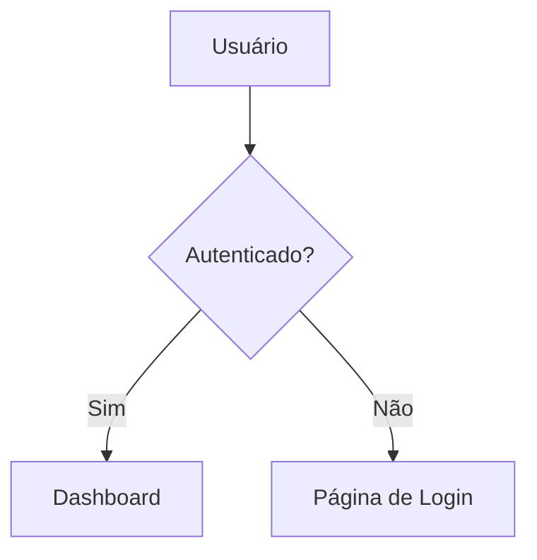

# Flowbook

> [English](./README.md) | [한국어](./README.ko.md) | [简体中文](./README.zh-CN.md) | [日本語](./README.ja.md) | [Español](./README.es.md) | **Português (BR)** | [Français](./README.fr.md) | [Русский](./README.ru.md) | [Deutsch](./README.de.md)

Storybook para fluxogramas. Descobre automaticamente arquivos de diagramas Mermaid no seu código, organiza por categoria e renderiza em um visualizador navegável.


## Início Rápido

```bash
# Inicializar — adiciona scripts + arquivo de exemplo
npx flowbook@latest init

# Iniciar servidor de desenvolvimento
npm run flowbook
# → http://localhost:6200

# Construir site estático
npm run build-flowbook
# → flowbook-static/
```

## CLI

```
flowbook init                Configurar Flowbook no seu projeto
flowbook dev  [--port 6200]  Iniciar o servidor de desenvolvimento
flowbook build [--out-dir d] Construir um site estático
```

### `flowbook init`

- Adiciona os scripts `"flowbook"` e `"build-flowbook"` ao seu `package.json`
- Cria `flows/example.flow.md` como template inicial

### `flowbook dev`

Inicia um servidor de desenvolvimento Vite em `http://localhost:6200` com HMR. Qualquer alteração em arquivos `.flow.md` ou `.flowchart.md` é refletida instantaneamente.

### `flowbook build`

Constrói um site estático em `flowbook-static/` (configurável via `--out-dir`). Faça deploy em qualquer lugar.

## Escrevendo Arquivos de Fluxo

Crie um arquivo `.flow.md` (ou `.flowchart.md`) em qualquer lugar do seu projeto:

````markdown
---
title: Fluxo de Login
category: Autenticação
tags: [auth, login, oauth]
order: 1
description: Fluxo de autenticação de usuário com OAuth2
---


````

O Flowbook descobre automaticamente o arquivo e o adiciona ao visualizador.

## Schema do Frontmatter

| Campo         | Tipo       | Obrigatório | Descrição                              |
|---------------|------------|-------------|----------------------------------------|
| `title`       | `string`   | Não         | Título exibido (padrão: nome do arquivo) |
| `category`    | `string`   | Não         | Categoria na barra lateral (padrão: "Uncategorized") |
| `tags`        | `string[]` | Não         | Tags filtráveis                        |
| `order`       | `number`   | Não         | Ordem dentro da categoria (padrão: 999)|
| `description` | `string`   | Não         | Descrição na visualização detalhada    |

## Descoberta de Arquivos

O Flowbook escaneia estes padrões por padrão:

```
**/*.flow.md
**/*.flowchart.md
```

Ignora `node_modules/`, `.git/` e `dist/`.

## Habilidade de Agente IA

`flowbook init` instala automaticamente habilidades de agente IA em todos os diretórios de agentes de codificação suportados.
Quando um agente de codificação (Claude Code, OpenAI Codex, VS Code Copilot, Cursor, Gemini CLI, etc.) detecta a palavra-chave **"flowbook"** no seu prompt, ele irá:

1. Analisar sua base de código em busca de fluxos lógicos (rotas de API, autenticação, gerenciamento de estado, lógica de negócios, etc.)
2. Configurar Flowbook se ainda não estiver inicializado
3. Gerar arquivos `.flow.md` com diagramas Mermaid para cada fluxo significativo
4. Verificar a compilação

### Instalação Manual de Habilidade

Se você não usou `flowbook init`, copie a habilidade manualmente:

```bash
# Claude Code
mkdir -p .claude/skills/flowbook
cp node_modules/flowbook/src/skills/flowbook/SKILL.md .claude/skills/flowbook/

# OpenAI Codex
mkdir -p .agents/skills/flowbook
cp node_modules/flowbook/src/skills/flowbook/SKILL.md .agents/skills/flowbook/

# VS Code / GitHub Copilot
mkdir -p .github/skills/flowbook
cp node_modules/flowbook/src/skills/flowbook/SKILL.md .github/skills/flowbook/

# Google Antigravity
mkdir -p .agent/skills/flowbook
cp node_modules/flowbook/src/skills/flowbook/SKILL.md .agent/skills/flowbook/

# Gemini CLI
mkdir -p .gemini/skills/flowbook
cp node_modules/flowbook/src/skills/flowbook/SKILL.md .gemini/skills/flowbook/

# Cursor
mkdir -p .cursor/skills/flowbook
cp node_modules/flowbook/src/skills/flowbook/SKILL.md .cursor/skills/flowbook/

# Windsurf (Codeium)
mkdir -p .windsurf/skills/flowbook
cp node_modules/flowbook/src/skills/flowbook/SKILL.md .windsurf/skills/flowbook/

# AmpCode
mkdir -p .amp/skills/flowbook
cp node_modules/flowbook/src/skills/flowbook/SKILL.md .amp/skills/flowbook/

# OpenCode / oh-my-opencode
mkdir -p .opencode/skills/flowbook
cp node_modules/flowbook/src/skills/flowbook/SKILL.md .opencode/skills/flowbook/
```

### Agentes Compatíveis

| Agente | Local da Habilidade |
|-------|---------------|
| Claude Code | `.claude/skills/flowbook/SKILL.md` |
| OpenAI Codex | `.agents/skills/flowbook/SKILL.md` |
| VS Code / GitHub Copilot | `.github/skills/flowbook/SKILL.md` |
| Google Antigravity | `.agent/skills/flowbook/SKILL.md` |
| Gemini CLI | `.gemini/skills/flowbook/SKILL.md` |
| Cursor | `.cursor/skills/flowbook/SKILL.md` |
| Windsurf (Codeium) | `.windsurf/skills/flowbook/SKILL.md` |
| AmpCode | `.amp/skills/flowbook/SKILL.md` |
| OpenCode / oh-my-opencode | `.opencode/skills/flowbook/SKILL.md` |

## Como Funciona

```
arquivos .flow.md ──→ Plugin Vite ──→ Módulo Virtual ──→ Visualizador React
                        │                   │
                        ├─ scan fast-glob   ├─ export default { flows: [...] }
                        ├─ gray-matter      │
                        │  parsing          └─ HMR na alteração de arquivo
                        └─ bloco mermaid
                           extração
```

1. **Descoberta** — `fast-glob` escaneia o projeto procurando `*.flow.md` / `*.flowchart.md`
2. **Parsing** — `gray-matter` extrai o frontmatter YAML; regex extrai blocos `` ```mermaid ``
3. **Módulo Virtual** — Plugin Vite serve os dados parseados como `virtual:flowbook-data`
4. **Renderização** — App React renderiza diagramas Mermaid via `mermaid.render()`
5. **HMR** — Alterações de arquivo invalidam o módulo virtual, disparando um reload

## Estrutura do Projeto

```
src/
├── types.ts                    # Tipos compartilhados (FlowEntry, FlowbookData)
├── node/
│   ├── cli.ts                  # Ponto de entrada CLI (init, dev, build)
│   ├── server.ts               # Servidor Vite programático e build
│   ├── init.ts                 # Lógica de inicialização do projeto
│   ├── discovery.ts            # Scanner de arquivos (fast-glob)
│   ├── parser.ts               # Extração de frontmatter + mermaid
│   └── plugin.ts               # Plugin de módulo virtual do Vite
└── client/
    ├── index.html              # HTML de entrada
    ├── main.tsx                # Entrada React
    ├── App.tsx                 # Layout com busca + barra lateral + visualizador
    ├── vite-env.d.ts           # Declarações de tipo do módulo virtual
    ├── styles/globals.css      # Tailwind v4 + estilos customizados
    └── components/
        ├── Header.tsx          # Logo, barra de busca, contagem de fluxos
        ├── Sidebar.tsx         # Árvore de categorias colapsável
        ├── MermaidRenderer.tsx # Renderização de diagramas Mermaid
        ├── FlowView.tsx        # Visualização detalhada de fluxo individual
        └── EmptyState.tsx      # Estado vazio com guia
```

## Desenvolvimento (Contribuição)

```bash
git clone https://github.com/Epsilondelta-ai/flowbook.git
cd flowbook
npm install

# Desenvolvimento local (usa o vite.config.ts raiz)
npm run dev

# Construir CLI
npm run build

# Testar CLI localmente
node dist/cli.js dev
node dist/cli.js build
```

## Stack Tecnológico

- **Vite** — Servidor de desenvolvimento com HMR
- **React 19** — UI
- **Mermaid 11** — Renderização de diagramas
- **Tailwind CSS v4** — Estilização
- **gray-matter** — Parsing de frontmatter YAML
- **fast-glob** — Descoberta de arquivos
- **tsup** — Bundler de CLI
- **TypeScript** — Segurança de tipos

## Licença

MIT
