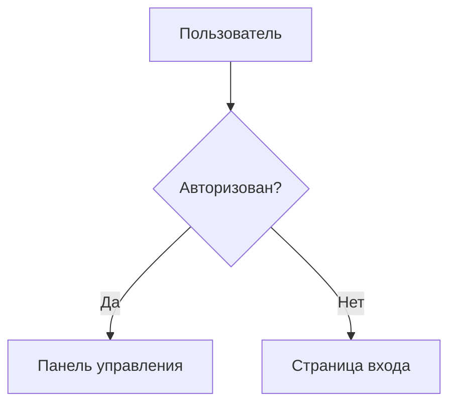

# Flowbook

> [English](./README.md) | [한국어](./README.ko.md) | [简体中文](./README.zh-CN.md) | [日本語](./README.ja.md) | [Español](./README.es.md) | [Português (BR)](./README.pt-BR.md) | [Français](./README.fr.md) | **Русский** | [Deutsch](./README.de.md)

Storybook для блок-схем. Автоматически обнаруживает файлы диаграмм Mermaid в вашем коде, организует их по категориям и отображает в удобном просмотрщике.


## Быстрый Старт

```bash
# Инициализация — добавляет скрипты + файл-пример
npx flowbook@latest init

# Запуск сервера разработки
npm run flowbook
# → http://localhost:6200

# Сборка статического сайта
npm run build-flowbook
# → flowbook-static/
```

## CLI

```
flowbook init                Настроить Flowbook в проекте
flowbook dev  [--port 6200]  Запустить сервер разработки
flowbook build [--out-dir d] Собрать статический сайт
```

### `flowbook init`

- Добавляет скрипты `"flowbook"` и `"build-flowbook"` в ваш `package.json`
- Создаёт `flows/example.flow.md` в качестве стартового шаблона

### `flowbook dev`

Запускает сервер разработки Vite на `http://localhost:6200` с поддержкой HMR. Любые изменения в файлах `.flow.md` или `.flowchart.md` отображаются мгновенно.

### `flowbook build`

Собирает статический сайт в `flowbook-static/` (настраивается через `--out-dir`). Разверните его где угодно.

## Создание Файлов Потоков

Создайте файл `.flow.md` (или `.flowchart.md`) в любом месте вашего проекта:

````markdown
---
title: Поток Авторизации
category: Аутентификация
tags: [auth, login, oauth]
order: 1
description: Поток аутентификации пользователя с OAuth2
---


````

Flowbook автоматически обнаружит файл и добавит его в просмотрщик.

## Схема Frontmatter

| Поле          | Тип        | Обязательно | Описание                              |
|---------------|------------|-------------|---------------------------------------|
| `title`       | `string`   | Нет         | Отображаемый заголовок (по умолчанию: имя файла) |
| `category`    | `string`   | Нет         | Категория в боковой панели (по умолчанию: "Uncategorized") |
| `tags`        | `string[]` | Нет         | Фильтруемые теги                      |
| `order`       | `number`   | Нет         | Порядок сортировки в категории (по умолчанию: 999) |
| `description` | `string`   | Нет         | Описание в детальном просмотре        |

## Обнаружение Файлов

Flowbook по умолчанию сканирует следующие шаблоны:

```
**/*.flow.md
**/*.flowchart.md
```

Игнорирует `node_modules/`, `.git/` и `dist/`.

## Навык AI-агента

`flowbook init` автоматически устанавливает навыки AI-агента во все поддерживаемые директории агентов кодирования.
Когда агент кодирования (Claude Code, OpenAI Codex, VS Code Copilot, Cursor, Gemini CLI и т.д.) обнаружит ключевое слово **"flowbook"** в вашем промпте, он:

1. Анализирует вашу базу кода на предмет логических потоков (API маршруты, аутентификация, управление состоянием, бизнес-логика и т.д.)
2. Настраивает Flowbook, если он еще не инициализирован
3. Генерирует файлы `.flow.md` с диаграммами Mermaid для каждого значимого потока
4. Проверяет сборку

### Настройка навыка вручную

Если вы не использовали `flowbook init`, скопируйте навык вручную:

```bash
# Claude Code
mkdir -p .claude/skills/flowbook
cp node_modules/flowbook/src/skills/flowbook/SKILL.md .claude/skills/flowbook/

# OpenAI Codex
mkdir -p .agents/skills/flowbook
cp node_modules/flowbook/src/skills/flowbook/SKILL.md .agents/skills/flowbook/

# VS Code / GitHub Copilot
mkdir -p .github/skills/flowbook
cp node_modules/flowbook/src/skills/flowbook/SKILL.md .github/skills/flowbook/

# Google Antigravity
mkdir -p .agent/skills/flowbook
cp node_modules/flowbook/src/skills/flowbook/SKILL.md .agent/skills/flowbook/

# Gemini CLI
mkdir -p .gemini/skills/flowbook
cp node_modules/flowbook/src/skills/flowbook/SKILL.md .gemini/skills/flowbook/

# Cursor
mkdir -p .cursor/skills/flowbook
cp node_modules/flowbook/src/skills/flowbook/SKILL.md .cursor/skills/flowbook/

# Windsurf (Codeium)
mkdir -p .windsurf/skills/flowbook
cp node_modules/flowbook/src/skills/flowbook/SKILL.md .windsurf/skills/flowbook/

# AmpCode
mkdir -p .amp/skills/flowbook
cp node_modules/flowbook/src/skills/flowbook/SKILL.md .amp/skills/flowbook/

# OpenCode / oh-my-opencode
mkdir -p .opencode/skills/flowbook
cp node_modules/flowbook/src/skills/flowbook/SKILL.md .opencode/skills/flowbook/
```

### Осведомленные агенты

| Агент | Местонахождение навыка |
|-------|---------------|
| Claude Code | `.claude/skills/flowbook/SKILL.md` |
| OpenAI Codex | `.agents/skills/flowbook/SKILL.md` |
| VS Code / GitHub Copilot | `.github/skills/flowbook/SKILL.md` |
| Google Antigravity | `.agent/skills/flowbook/SKILL.md` |
| Gemini CLI | `.gemini/skills/flowbook/SKILL.md` |
| Cursor | `.cursor/skills/flowbook/SKILL.md` |
| Windsurf (Codeium) | `.windsurf/skills/flowbook/SKILL.md` |
| AmpCode | `.amp/skills/flowbook/SKILL.md` |
| OpenCode / oh-my-opencode | `.opencode/skills/flowbook/SKILL.md` |

## Как Это Работает

```
файлы .flow.md ──→ Плагин Vite ──→ Виртуальный модуль ──→ React-просмотрщик
                     │                    │
                     ├─ сканирование      ├─ export default { flows: [...] }
                     │  fast-glob         │
                     ├─ gray-matter       └─ HMR при изменении файла
                     │  парсинг
                     └─ блок mermaid
                        извлечение
```

1. **Обнаружение** — `fast-glob` сканирует проект в поисках `*.flow.md` / `*.flowchart.md`
2. **Парсинг** — `gray-matter` извлекает YAML frontmatter; регулярные выражения извлекают блоки `` ```mermaid ``
3. **Виртуальный модуль** — Плагин Vite предоставляет распарсенные данные как `virtual:flowbook-data`
4. **Рендеринг** — React-приложение рендерит диаграммы Mermaid через `mermaid.render()`
5. **HMR** — Изменения файлов инвалидируют виртуальный модуль, запуская перезагрузку

## Структура Проекта

```
src/
├── types.ts                    # Общие типы (FlowEntry, FlowbookData)
├── node/
│   ├── cli.ts                  # Точка входа CLI (init, dev, build)
│   ├── server.ts               # Программный сервер Vite и сборка
│   ├── init.ts                 # Логика инициализации проекта
│   ├── discovery.ts            # Сканер файлов (fast-glob)
│   ├── parser.ts               # Извлечение frontmatter + mermaid
│   └── plugin.ts               # Плагин виртуального модуля Vite
└── client/
    ├── index.html              # Входной HTML
    ├── main.tsx                # Точка входа React
    ├── App.tsx                 # Макет с поиском + боковая панель + просмотрщик
    ├── vite-env.d.ts           # Объявления типов виртуального модуля
    ├── styles/globals.css      # Tailwind v4 + пользовательские стили
    └── components/
        ├── Header.tsx          # Логотип, поиск, количество потоков
        ├── Sidebar.tsx         # Сворачиваемое дерево категорий
        ├── MermaidRenderer.tsx # Рендеринг диаграмм Mermaid
        ├── FlowView.tsx        # Детальный просмотр отдельного потока
        └── EmptyState.tsx      # Пустое состояние с инструкцией
```

## Разработка (Вклад)

```bash
git clone https://github.com/Epsilondelta-ai/flowbook.git
cd flowbook
npm install

# Локальная разработка (используется корневой vite.config.ts)
npm run dev

# Сборка CLI
npm run build

# Локальное тестирование CLI
node dist/cli.js dev
node dist/cli.js build
```

## Технологический Стек

- **Vite** — Сервер разработки с HMR
- **React 19** — Пользовательский интерфейс
- **Mermaid 11** — Рендеринг диаграмм
- **Tailwind CSS v4** — Стилизация
- **gray-matter** — Парсинг YAML frontmatter
- **fast-glob** — Обнаружение файлов
- **tsup** — Сборщик CLI
- **TypeScript** — Типобезопасность

## Лицензия

MIT
