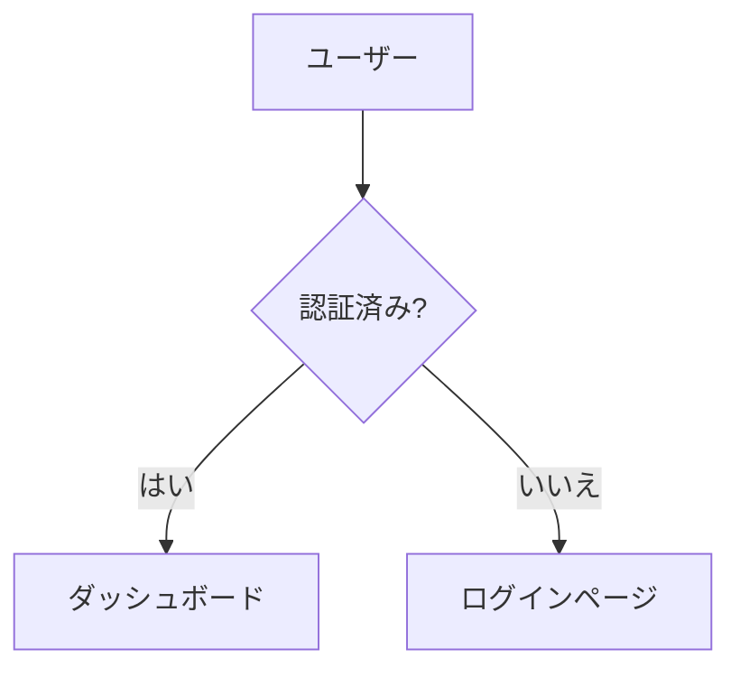

# Flowbook

> **[English](../README.md)** | [한국어](./README.ko.md) | [简体中文](./README.zh-CN.md) | **日本語** | [Español](./README.es.md) | [Português (BR)](./README.pt-BR.md) | [Français](./README.fr.md) | [Русский](./README.ru.md) | [Deutsch](./README.de.md)

フローチャートのための Storybook。コードベースから Mermaid ダイアグラムファイルを自動検出し、カテゴリ別に整理して、ブラウザで閲覧可能なビューアでレンダリングします。


## クイックスタート

```bash
# 初期化 — スクリプト + サンプルファイルを追加
npx flowbook@latest init

# 開発サーバーを起動
npm run flowbook
# → http://localhost:6200

# 静的サイトをビルド
npm run build-flowbook
# → flowbook-static/
```

## CLI

```
flowbook init                プロジェクトに Flowbook をセットアップ
flowbook dev  [--port 6200]  開発サーバーを起動
flowbook build [--out-dir d] 静的サイトをビルド
flowbook skill <agent> [-g]  AI エージェントスキル & /flowbook コマンドをインストール

### `flowbook init`

- `package.json` に `"flowbook"` と `"build-flowbook"` スクリプトを追加します
- `flows/example.flow.md` をスターターテンプレートとして作成します
- サポートされているすべての AI エージェントディレクトリに AI エージェントスキルをインストールします

### `flowbook dev`

`http://localhost:6200` で HMR 対応の Vite 開発サーバーを起動します。`.flow.md` や `.flowchart.md` ファイルの変更が即座に反映されます。

### `flowbook build`

`flowbook-static/` ディレクトリに静的サイトをビルドします（`--out-dir` で変更可能）。どこにでもデプロイできます。

## フローファイルの作成

プロジェクト内の任意の場所に `.flow.md`（または `.flowchart.md`）ファイルを作成してください：

````markdown
---
title: ログインフロー
category: 認証
tags: [auth, login, oauth]
order: 1
description: OAuth2 を使用したユーザー認証フロー
---


````

Flowbook がファイルを自動検出し、ビューアに追加します。

## フロントマタースキーマ

| フィールド    | 型         | 必須   | 説明                                |
|---------------|------------|--------|-------------------------------------|
| `title`       | `string`   | いいえ | 表示タイトル（デフォルト: ファイル名）|
| `category`    | `string`   | いいえ | サイドバーのカテゴリ（デフォルト: "Uncategorized"）|
| `tags`        | `string[]` | いいえ | フィルタリング可能なタグ            |
| `order`       | `number`   | いいえ | カテゴリ内の並び順（デフォルト: 999）|
| `description` | `string`   | いいえ | 詳細ビューに表示される説明          |

## ファイル検出

Flowbook はデフォルトで以下のパターンをスキャンします：

```
**/*.flow.md
**/*.flowchart.md
```

`node_modules/`、`.git/`、`dist/` は無視します。

## AI Agent Skill

`flowbook init` はサポートされているすべてのコーディングエージェントディレクトリに AI エージェントスキルを自動的にインストールします。
コーディングエージェント（Claude Code、OpenAI Codex、VS Code Copilot、Cursor、Gemini CLI など）がプロンプト内の **"flowbook"** キーワードを検出した場合、以下を実行します：

1. コードベース内の論理的なフローを分析（API ルート、認証、状态管理、ビジネスロジックなど）
2. まだ初期化されていない場合、Flowbook を設定
3. すべての重要なフローに対して Mermaid ダイアグラム付き `.flow.md` ファイルを生成
4. ビルドを検証

### `flowbook skill`

特定のエージェントに対してスキルと `/flowbook` スラッシュコマンドをインストールします：

```bash
# 特定のエージェントにインストール（プロジェクトレベル）
flowbook skill opencode
flowbook skill claude
flowbook skill cursor

# すべてのエージェントにインストール
flowbook skill all

# グローバルインストール（すべてのプロジェクトで利用可能）
flowbook skill opencode -g
flowbook skill all --global
```

✅ **インストールされるもの：**

| コンポーネント | 説明 |
|-----------|-------------|
| **スキル** (`SKILL.md`) | プロンプトで "flowbook" を言及したときに自動トリガー |
| **スラッシュコマンド** (`/flowbook`) | 明示的なトリガー — `/flowbook` を入力してフローチャートを生成 |

スラッシュコマンドはこれをサポートするエージェントにインストールされます：**Claude Code**、**Cursor**、**Windsurf**、**OpenCode**。

### skills.sh 経由のインストール

[skills.sh](https://skills.sh) を使用してスキルを単独でインストールすることもできます：

```bash
# プロジェクトレベル
npx skills add Epsilondelta-ai/flowbook

# グローバル
npx skills add -g Epsilondelta-ai/flowbook
```

> **注意：** `npx skills add` はスキルのみをインストールします (SKILL.md)。`/flowbook` スラッシュコマンドをもインストールするには `flowbook skill` を使用してください。

### サポートされているエージェント

| エージェント | スキル | スラッシュコマンド |
|-------|-------|---------------|
| Claude Code | `.claude/skills/flowbook/SKILL.md` | `.claude/commands/flowbook.md` |
| OpenAI Codex | `.agents/skills/flowbook/SKILL.md` | — |
| VS Code / GitHub Copilot | `.github/skills/flowbook/SKILL.md` | — |
| Google Antigravity | `.agent/skills/flowbook/SKILL.md` | — |
| Gemini CLI | `.gemini/skills/flowbook/SKILL.md` | — |
| Cursor | `.cursor/skills/flowbook/SKILL.md` | `.cursor/commands/flowbook.md` |
| Windsurf (Codeium) | `.windsurf/skills/flowbook/SKILL.md` | `.windsurf/workflows/flowbook.md` |
| AmpCode | `.amp/skills/flowbook/SKILL.md` | — |
| OpenCode / oh-my-opencode | `.opencode/skills/flowbook/SKILL.md` | `.opencode/command/flowbook.md` |

<details>
<summary>手動インストール</summary>

`flowbook skill` または `npx skills add` を使用しなかった場合、ファイルを手動でコピーしてください：

```bash
# スキル
mkdir -p .claude/skills/flowbook
cp node_modules/flowbook/src/skills/flowbook/SKILL.md .claude/skills/flowbook/

# スラッシュコマンド (Claude Code)
mkdir -p .claude/commands
cp node_modules/flowbook/src/commands/flowbook.md .claude/commands/
```

上表の適切なパスを使用してディレクトリを置き換えてください。

</details>
## 仕組み

```
.flow.md ファイル ──→ Vite プラグイン ──→ 仮想モジュール ──→ React ビューア
                        │                     │
                        ├─ fast-glob スキャン  ├─ export default { flows: [...] }
                        ├─ gray-matter        │
                        │  パース             └─ ファイル変更時に HMR
                        └─ mermaid ブロック
                           抽出
```

1. **検出** — `fast-glob` がプロジェクト内の `*.flow.md` / `*.flowchart.md` をスキャン
2. **パース** — `gray-matter` が YAML フロントマターを抽出；正規表現で `` ```mermaid `` ブロックを抽出
3. **仮想モジュール** — Vite プラグインがパースしたデータを `virtual:flowbook-data` として提供
4. **レンダリング** — React アプリが `mermaid.render()` で Mermaid ダイアグラムをレンダリング
5. **HMR** — ファイル変更時に仮想モジュールを無効化し、リロードをトリガー

## プロジェクト構成

```
src/
├── types.ts                    # 共有種 (FlowEntry, FlowbookData)
├── node/
│   ├── cli.ts                  # CLI エントリーポイント (init, dev, build, skill)
│   ├── server.ts               # プログラマティック Vite サーバー & ビルド
│   ├── init.ts                 # プロジェクト初期化ロジック
│   ├── skill.ts                # AI エージェントスキル & コマンドインストーラー
│   ├── discovery.ts            # ファイルスキャナー (fast-glob)
│   ├── parser.ts               # フロントマター + mermaid 抽出
│   └── plugin.ts               # Vite 仮想モジュールプラグイン
├── skills/
│   └── flowbook/
│       └── SKILL.md            # AI エージェントスキル定義
├── commands/
│   ├── flowbook.md             # スラッシュコマンド (フロントマター形式)
│   └── flowbook.plain.md       # スラッシュコマンド (純マークダウン形式)
└── client/
    ├── index.html              # エントリ HTML
    ├── main.tsx                # React エントリ
    ├── App.tsx                 # 検索 + サイドバー + ビューアーレイアウト
    ├── vite-env.d.ts           # 仮想モジュール種声明
    ├── styles/globals.css      # Tailwind v4 + カスタムスタイル
    └── components/
        ├── Header.tsx          # ロゴ、検索バー、フロー数
        ├── Sidebar.tsx         # 折りたたみ可能なカテゴリツリー
        ├── MermaidRenderer.tsx # Mermaid ダイアグラムレンダリング
        ├── FlowView.tsx        # 単一フロー詳細ビュー
        └── EmptyState.tsx      # 空状态ガイド
```

## 開発（コントリビューション）

```bash
git clone https://github.com/Epsilondelta-ai/flowbook.git
cd flowbook
npm install

# ローカル開発（ルートの vite.config.ts を使用）
npm run dev

# CLI をビルド
npm run build

# ローカルで CLI をテスト
node dist/cli.js dev
node dist/cli.js build
```

## 技術スタック

- **Vite** — HMR 対応開発サーバー
- **React 19** — UI
- **Mermaid 11** — ダイアグラムレンダリング
- **Tailwind CSS v4** — スタイリング
- **gray-matter** — YAML フロントマターパーサー
- **fast-glob** — ファイル検出
- **tsup** — CLI バンドラー
- **TypeScript** — 型安全性

## ライセンス

MIT
