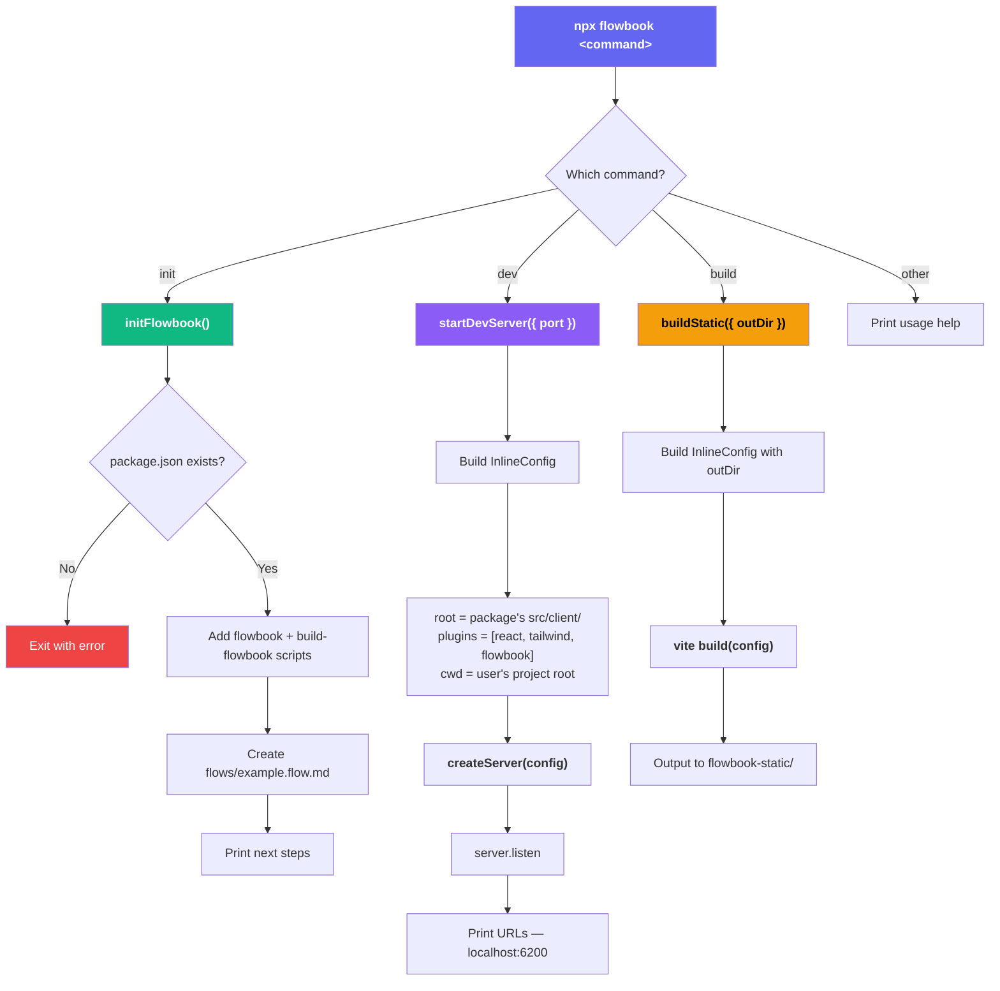

```mermaid
flowchart TD
    A["`**npx flowbook &lt;command&gt;**`"] --> B{Which command?}

    B -->|init| C["`**initFlowbook()**`"]
    C --> C1{package.json exists?}
    C1 -->|No| C2[Exit with error]
    C1 -->|Yes| C3[Add flowbook + build-flowbook scripts]
    C3 --> C4[Create flows/example.flow.md]
    C4 --> C5[Print next steps]

    B -->|dev| D["`**startDevServer({ port })**`"]
    D --> D1[Build InlineConfig]
    D1 --> D2["`root = package's src/client/
    plugins = [react, tailwind, flowbook]
    cwd = user's project root`"]
    D2 --> D3["`**createServer(config)**`"]
    D3 --> D4[server.listen]
    D4 --> D5[Print URLs — localhost:6200]

    B -->|build| E["`**buildStatic({ outDir })**`"]
    E --> E1[Build InlineConfig with outDir]
    E1 --> E2["`**vite build(config)**`"]
    E2 --> E3[Output to flowbook-static/]

    B -->|other| F[Print usage help]

    style A fill:#6366f1,color:#fff
    style C fill:#10b981,color:#fff
    style D fill:#8b5cf6,color:#fff
    style E fill:#f59e0b,color:#000
    style C2 fill:#ef4444,color:#fff
```
