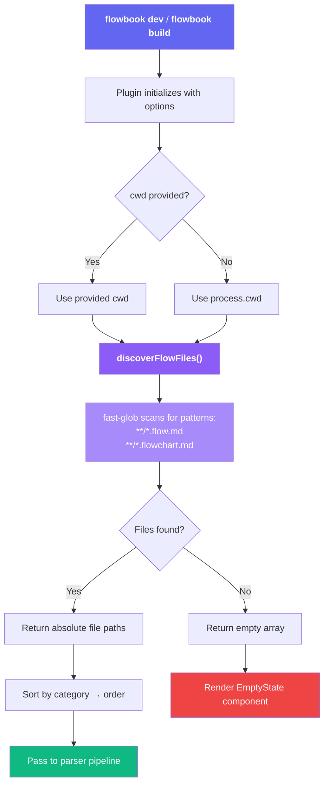

```mermaid
flowchart TD
    A["`**flowbook dev** / **flowbook build**`"] --> B[Plugin initializes with options]
    B --> C{cwd provided?}
    C -->|Yes| D[Use provided cwd]
    C -->|No| E[Use process.cwd]
    D --> F["`**discoverFlowFiles()**`"]
    E --> F
    F --> G["`fast-glob scans for patterns:
    **/*.flow.md
    **/*.flowchart.md`"]
    G --> H{Files found?}
    H -->|Yes| I[Return absolute file paths]
    H -->|No| J[Return empty array]
    I --> K[Sort by category → order]
    J --> L[Render EmptyState component]
    K --> M[Pass to parser pipeline]

    style A fill:#6366f1,color:#fff
    style F fill:#8b5cf6,color:#fff
    style G fill:#a78bfa,color:#fff
    style L fill:#ef4444,color:#fff
    style M fill:#10b981,color:#fff
```
