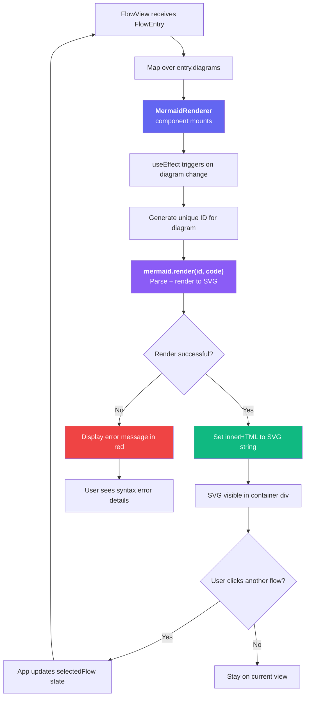

```mermaid
flowchart TD
    A[FlowView receives FlowEntry] --> B[Map over entry.diagrams]
    B --> C["`**MermaidRenderer**
    component mounts`"]
    C --> D[useEffect triggers on diagram change]
    D --> E[Generate unique ID for diagram]
    E --> F["`**mermaid.render(id, code)**
    Parse + render to SVG`"]
    F --> G{Render successful?}
    G -->|Yes| H[Set innerHTML to SVG string]
    G -->|No| I[Display error message in red]
    H --> J[SVG visible in container div]
    I --> K[User sees syntax error details]

    J --> L{User clicks another flow?}
    L -->|Yes| M[App updates selectedFlow state]
    M --> A
    L -->|No| N[Stay on current view]

    style C fill:#6366f1,color:#fff
    style F fill:#8b5cf6,color:#fff
    style H fill:#10b981,color:#fff
    style I fill:#ef4444,color:#fff
```
