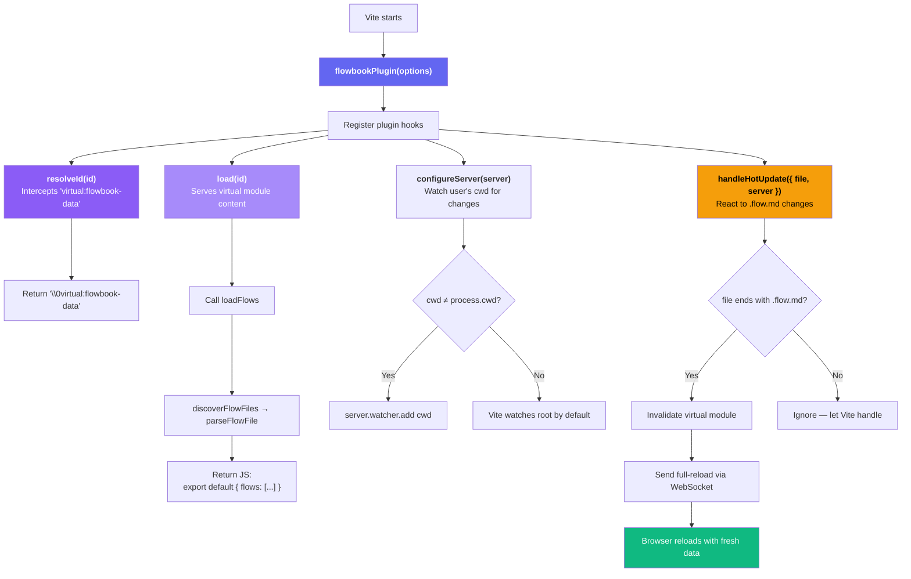

```mermaid
flowchart TD
    A[Vite starts] --> B["`**flowbookPlugin(options)**`"]
    B --> C[Register plugin hooks]

    C --> D["`**resolveId(id)**
    Intercepts 'virtual:flowbook-data'`"]
    D --> E["Return '\\0virtual:flowbook-data'"]

    C --> F["`**load(id)**
    Serves virtual module content`"]
    F --> G[Call loadFlows]
    G --> H[discoverFlowFiles → parseFlowFile]
    H --> I["`Return JS:
    export default { flows: [...] }`"]

    C --> J["`**configureServer(server)**
    Watch user's cwd for changes`"]
    J --> K{cwd ≠ process.cwd?}
    K -->|Yes| L[server.watcher.add cwd]
    K -->|No| M[Vite watches root by default]

    C --> N["`**handleHotUpdate({ file, server })**
    React to .flow.md changes`"]
    N --> O{file ends with .flow.md?}
    O -->|Yes| P[Invalidate virtual module]
    P --> Q[Send full-reload via WebSocket]
    O -->|No| R[Ignore — let Vite handle]

    Q --> S[Browser reloads with fresh data]

    style B fill:#6366f1,color:#fff
    style D fill:#8b5cf6,color:#fff
    style F fill:#a78bfa,color:#fff
    style N fill:#f59e0b,color:#000
    style S fill:#10b981,color:#fff
```
