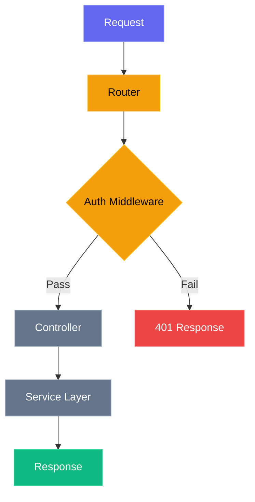

```mermaid
flowchart TD
    A[Request] --> B[Router]
    B --> C{Auth Middleware}
    C -->|Pass| D[Controller]
    C -->|Fail| E[401 Response]
    D --> F[Service Layer]
    F --> G[Response]

    classDef entry fill:#6366f1,stroke:#818cf8,color:#fff
    classDef validation fill:#f59e0b,stroke:#fbbf24,color:#000
    classDef success fill:#10b981,stroke:#34d399,color:#fff
    classDef error fill:#ef4444,stroke:#f87171,color:#fff
    classDef processing fill:#64748b,stroke:#94a3b8,color:#fff

    class A entry
    class B,C validation
    class D,F processing
    class E error
    class G success
```
