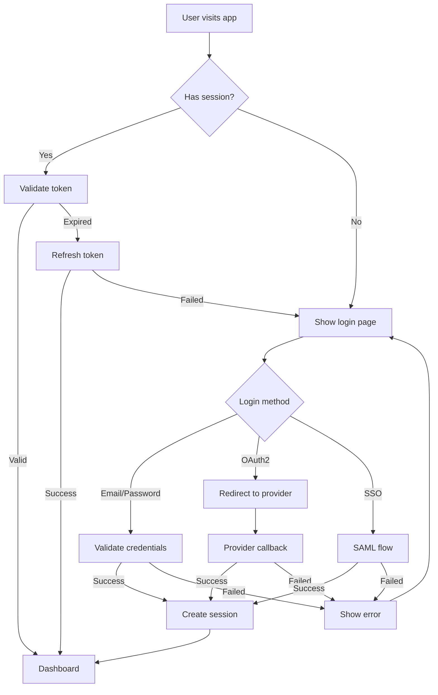

```mermaid
flowchart TD
    A[User visits app] --> B{Has session?}
    B -->|Yes| C[Validate token]
    B -->|No| D[Show login page]

    C -->|Valid| E[Dashboard]
    C -->|Expired| F[Refresh token]

    F -->|Success| E
    F -->|Failed| D

    D --> G{Login method}
    G -->|Email/Password| H[Validate credentials]
    G -->|OAuth2| I[Redirect to provider]
    G -->|SSO| J[SAML flow]

    H -->|Success| K[Create session]
    H -->|Failed| L[Show error]

    I --> M[Provider callback]
    M -->|Success| K
    M -->|Failed| L

    J -->|Success| K
    J -->|Failed| L

    K --> E
    L --> D
```
