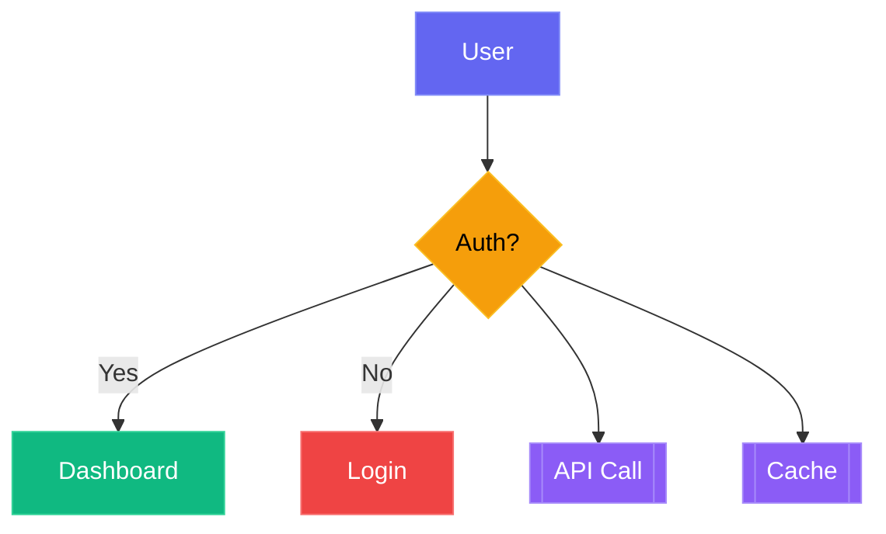

```mermaid
flowchart TD
    A[User] --> B{Auth?}
    B -->|Yes| C[Dashboard]
    B -->|No| D[Login]
    B --> E[[API Call]]
    B --> F[[Cache]]

    classDef entry fill:#6366f1,stroke:#818cf8,color:#fff
    classDef success fill:#10b981,stroke:#34d399,color:#fff
    classDef error fill:#ef4444,stroke:#f87171,color:#fff
    classDef validation fill:#f59e0b,stroke:#fbbf24,color:#000
    classDef external fill:#8b5cf6,stroke:#a78bfa,color:#fff

    class A entry
    class B validation
    class C success
    class D error
    class E,F external
```
