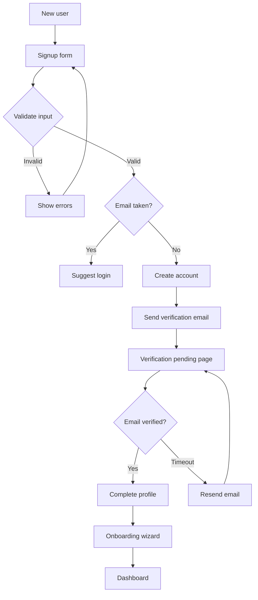

```mermaid
flowchart TD
    A[New user] --> B[Signup form]
    B --> C{Validate input}

    C -->|Invalid| D[Show errors]
    D --> B

    C -->|Valid| E{Email taken?}
    E -->|Yes| F[Suggest login]
    E -->|No| G[Create account]

    G --> H[Send verification email]
    H --> I[Verification pending page]

    I --> J{Email verified?}
    J -->|Yes| K[Complete profile]
    J -->|Timeout| L[Resend email]
    L --> I

    K --> M[Onboarding wizard]
    M --> N[Dashboard]
```
