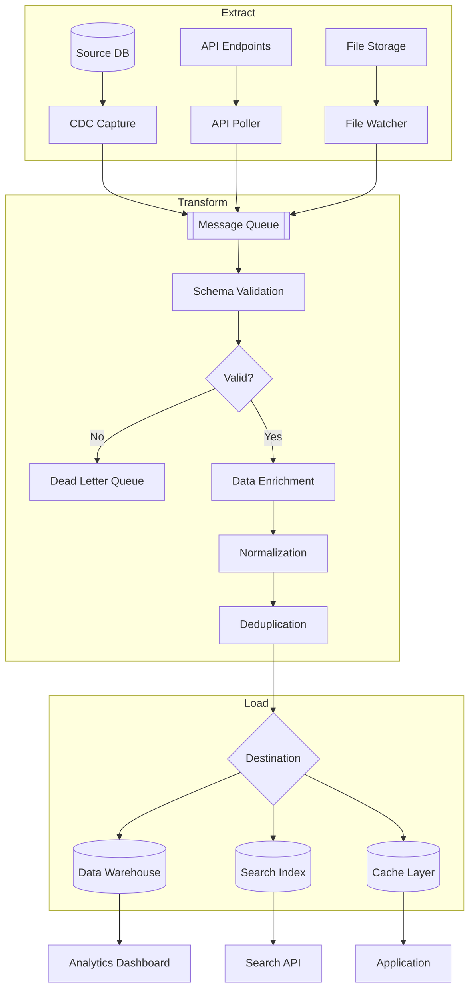

```mermaid
flowchart TD
    subgraph Extract
        A[(Source DB)] --> B[CDC Capture]
        C[API Endpoints] --> D[API Poller]
        E[File Storage] --> F[File Watcher]
    end

    B --> G[[Message Queue]]
    D --> G
    F --> G

    subgraph Transform
        G --> H[Schema Validation]
        H --> I{Valid?}
        I -->|No| J[Dead Letter Queue]
        I -->|Yes| K[Data Enrichment]
        K --> L[Normalization]
        L --> M[Deduplication]
    end

    subgraph Load
        M --> N{Destination}
        N --> O[(Data Warehouse)]
        N --> P[(Search Index)]
        N --> Q[(Cache Layer)]
    end

    O --> R[Analytics Dashboard]
    P --> S[Search API]
    Q --> T[Application]
```
