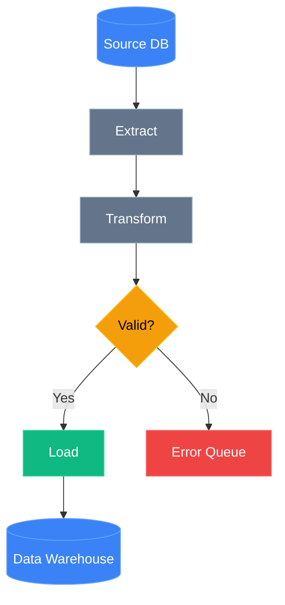

```mermaid
flowchart TD
    A[(Source DB)] --> B[Extract]
    B --> C[Transform]
    C --> D{Valid?}
    D -->|Yes| E[Load]
    D -->|No| F[Error Queue]
    E --> G[(Data Warehouse)]

    classDef data fill:#3b82f6,stroke:#60a5fa,color:#fff
    classDef processing fill:#64748b,stroke:#94a3b8,color:#fff
    classDef validation fill:#f59e0b,stroke:#fbbf24,color:#000
    classDef success fill:#10b981,stroke:#34d399,color:#fff
    classDef error fill:#ef4444,stroke:#f87171,color:#fff

    class A,G data
    class B,C processing
    class D validation
    class E success
    class F error
```
