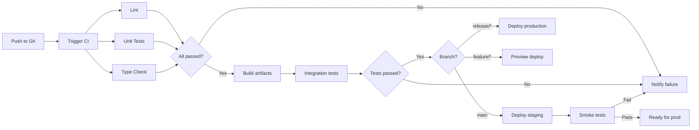

```mermaid
flowchart LR
    A[Push to Git] --> B[Trigger CI]

    B --> C[Lint]
    B --> D[Unit Tests]
    B --> E[Type Check]

    C --> F{All passed?}
    D --> F
    E --> F

    F -->|No| G[Notify failure]
    F -->|Yes| H[Build artifacts]

    H --> I[Integration tests]
    I --> J{Tests passed?}

    J -->|No| G
    J -->|Yes| K{Branch?}

    K -->|main| L[Deploy staging]
    K -->|release/*| M[Deploy production]
    K -->|feature/*| N[Preview deploy]

    L --> O[Smoke tests]
    O -->|Pass| P[Ready for prod]
    O -->|Fail| G
```
