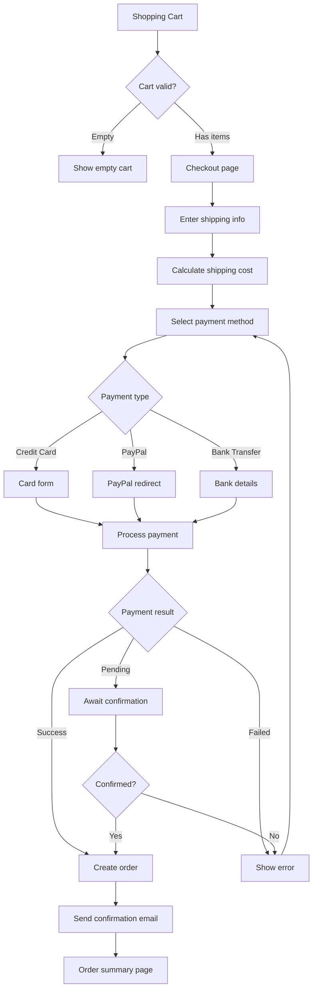

```mermaid
flowchart TD
    A[Shopping Cart] --> B{Cart valid?}
    B -->|Empty| C[Show empty cart]
    B -->|Has items| D[Checkout page]

    D --> E[Enter shipping info]
    E --> F[Calculate shipping cost]
    F --> G[Select payment method]

    G --> H{Payment type}
    H -->|Credit Card| I[Card form]
    H -->|PayPal| J[PayPal redirect]
    H -->|Bank Transfer| K[Bank details]

    I --> L[Process payment]
    J --> L
    K --> L

    L --> M{Payment result}
    M -->|Success| N[Create order]
    M -->|Failed| O[Show error]
    M -->|Pending| P[Await confirmation]

    O --> G
    P --> Q{Confirmed?}
    Q -->|Yes| N
    Q -->|No| O

    N --> R[Send confirmation email]
    R --> S[Order summary page]
```
