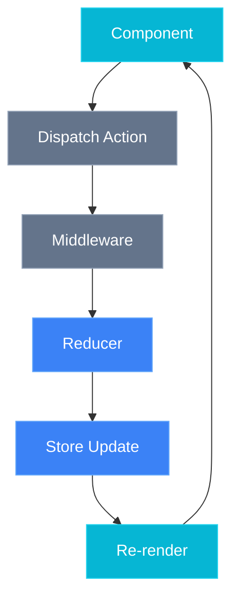

```mermaid
flowchart TD
    A[Component] --> B[Dispatch Action]
    B --> C[Middleware]
    C --> D[Reducer]
    D --> E[Store Update]
    E --> F[Re-render]
    F --> A

    classDef ui fill:#06b6d4,stroke:#22d3ee,color:#fff
    classDef processing fill:#64748b,stroke:#94a3b8,color:#fff
    classDef data fill:#3b82f6,stroke:#60a5fa,color:#fff

    class A,F ui
    class B,C processing
    class D,E data
```
